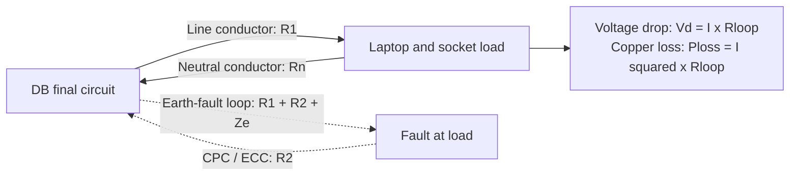
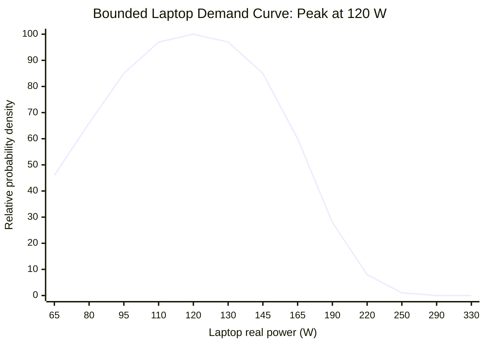
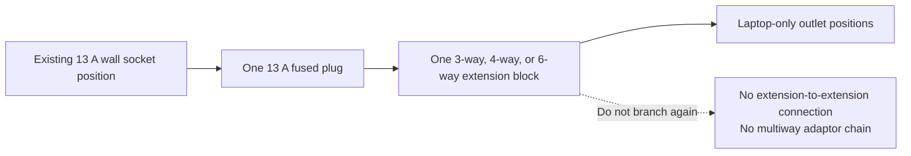

# Ground Floor DB-01 Electrical Load and Outlet Provision Assessment

**University of Bolton**  
**Distribution board:** DB - Ground Floor 01  
**Supply shown on schedule:** S.M.D.B - GF  
**Incomer entry as written:** Rating of Incomer: 63 A TP 150 A TP 100 B

<table>
    <tbody>
        <tr><td bgcolor="#dbeafe"><strong>Report reference</strong></td><td>GF-DB01-LA-001</td></tr>
        <tr><td bgcolor="#dbeafe"><strong>Revision</strong></td><td>P01</td></tr>
        <tr><td bgcolor="#dbeafe"><strong>Report status</strong></td><td>Draft for consultation and electrical design review</td></tr>
        <tr><td bgcolor="#dbeafe"><strong>Prepared by</strong></td><td>Akbar Qamar</td></tr>
        <tr><td bgcolor="#dbeafe"><strong>Report date</strong></td><td>13 September 2026</td></tr>
        <tr><td bgcolor="#dbeafe"><strong>Assessment basis</strong></td><td>DB schedule, student occupancy data, and a laptop-demand statistical model</td></tr>
    </tbody>
</table>

## 1. Executive Summary

This report assesses the recorded classroom socket circuits supplied by DB - Ground Floor 01. It uses maximum classroom occupancies, a bounded laptop-demand curve peaked at 120 W, and 80%, 60%, and 40% simultaneous-use scenarios. The analysis is limited to Rooms 01 to 05 and laptop demand; it is not a final electrical design, site test, or installation instruction.

<table>
    <thead bgcolor="#dbeafe">
        <tr><th>Scenario</th><th>Highest modelled 40 A phase-pole P95</th><th>Electrical status</th><th>Outlet-position basis</th></tr>
    </thead>
    <tbody>
        <tr><td>80% simultaneous use</td><td>33.27 A, Section 2 Y pole</td><td bgcolor="#fef9c3">Yellow: 80% to less than 90% of 40 A</td><td>Mean demand: 164 positions</td></tr>
        <tr><td>60% simultaneous use</td><td>26.12 A, Section 2 Y pole</td><td bgcolor="#dcfce7">Green: below 80% of 40 A</td><td>P95 room-by-room availability: 147 positions</td></tr>
        <tr><td>40% simultaneous use</td><td>18.55 A, Section 2 Y pole</td><td bgcolor="#dcfce7">Green: below 80% of 40 A</td><td>Mean demand: 82 positions</td></tr>
        <tr><td>Assessment scope</td><td>Rooms 01 to 05 laptop demand</td><td bgcolor="#e5e7eb">Grey: outside current assessment scope</td><td>Outlet provision assessed for listed classroom loads</td></tr>
    </tbody>
</table>

The recommended planning provision is 147 independently usable outlet positions across Rooms 01 to 05. This is 102 positions above the 45 positions recorded in the schedule and provides P95 outlet availability for the 60% use scenario. The result is a planning calculation for the stated model and not an installation instruction.

## 2. Scope and Objective

This report maps the listed classroom supplies from DB - Ground Floor 01 and models laptop demand on the existing socket circuits. It compares 80%, 60%, and 40% simultaneous laptop-use scenarios against the listed 32 A final-circuit MCBs and the 40 A, four-pole protective devices in Sections 2 and 3.

## 3. Documents Reviewed

- `Ground_Floor_01_Load_Distribution_Schedule.xlsx`
- `Classroom Consuption.xlsx`

## 4. Existing Electrical Distribution

### 4.1 Power Flow Diagram

```mermaid
flowchart TD
    SMD["S.M.D.B - GF"] --> IN["DB - Ground Floor 01\nRating of Incomer: 63 A TP 150 A TP 100 B\n4 x 16 sq.mm Cu SWA + 10 sq.mm ECC shown"]

    IN --> S1["Section 1\n40 A 4P, 100 mA\nClassroom lighting"]
    IN --> S2["Section 2\n40 A 4P, 30 mA\nClassroom sockets and lobby"]
    IN --> S3["Section 3\n40 A 4P, 30 mA\nClassroom sockets and passage"]
    IN --> S4["Section 4\n40 A 4P, 30 mA\nWater heater"]

    S1 --> R1["R1: Room 05\n16 A, 12 LED = 0.42 kW"]
    S1 --> Y1["Y1: Room 04\n16 A, 12 LED = 0.42 kW"]
    S1 --> B1["B1: Room 03\n16 A, 12 LED = 0.42 kW"]
    S1 --> R2["R2: Room 02\n10 A, 12 LED = 0.42 kW"]
    S1 --> Y2["Y2: Room 01\n10 A, 12 LED = 0.42 kW"]
    S1 --> B2["B2: Room 01 (duplicate record)\n10 A, 12 LED = 0.42 kW"]

    S2 --> R4["R4: Room 06\n32 A ring, 5 sockets = 1.00 kW"]
    S2 --> Y4["Y4: Room 04\n32 A ring, 5 sockets = 1.00 kW"]
    S2 --> B4["B4: Room 03\n32 A ring, 5 sockets = 1.00 kW"]
    S2 --> R5["R5: Room 05\n32 A ring, 5 sockets = 1.00 kW"]
    S2 --> Y5["Y5: Room 04 (second circuit)\n32 A ring, 5 sockets = 1.00 kW"]
    S2 --> B5["B5: Room 03 (second circuit)\n32 A ring, 5 sockets = 1.00 kW"]
    S2 --> R6["R6: Room 02\n32 A ring, 5 sockets = 1.00 kW"]
    S2 --> Y6["Y6: Room 01\n32 A ring, 5 sockets = 1.00 kW"]

    S3 --> R7["R7: Room 02 (second circuit)\n32 A ring, 5 sockets = 1.00 kW"]
    S3 --> Y7["Y7: Room 01 (second circuit)\n32 A ring, 5 sockets = 1.00 kW"]

    S4 --> R8["R8: 2C water heater\n3.00 kW"]

    classDef supply fill:#dbeafe,stroke:#1d4ed8,color:#111827;
    classDef protection fill:#fef3c7,stroke:#b45309,color:#111827;
    classDef final fill:#dcfce7,stroke:#15803d,color:#111827;
    class SMD,IN supply;
    class S1,S2,S3,S4 protection;
    class R1,Y1,B1,R2,Y2,B2,R4,Y4,B4,R5,Y5,B5,R6,Y6,R7,Y7,R8 final;
```

The phase letter at the beginning of each circuit reference is the phase recorded in the distribution schedule: `R`, `Y`, or `B`.

### 4.2 Classroom Feed Matrix

| Classroom | Lighting feed recorded | Socket-outlet feed(s) recorded | Listed socket quantity | Design load recorded for sockets |
|---|---|---|---:|---:|
| Room 01 | Y2, 10 A, 0.42 kW; B2, 10 A, 0.42 kW | Y6 and Y7, both 32 A ring circuits | 10 | 2.00 kW |
| Room 02 | R2, 10 A, 0.42 kW | R6 and R7, both 32 A ring circuits | 10 | 2.00 kW |
| Room 03 | B1, 16 A, 0.42 kW | B4 and B5, both 32 A ring circuits | 10 | 2.00 kW |
| Room 04 | Y1, 16 A, 0.42 kW | Y4 and Y5, both 32 A ring circuits | 10 | 2.00 kW |
| Room 05 | R1, 16 A, 0.42 kW | R5, 32 A ring circuit | 5 | 1.00 kW |
| Room 06 | No lighting circuit identified in the schedule | R4, 32 A ring circuit | 5 | 1.00 kW |

All listed socket ring circuits use 4 sq.mm circuit conductors, 4 sq.mm ECC conductors, and 20 mm conduit according to the schedule.

### 4.3 Schedule Load Summary

<table>
    <thead bgcolor="#dbeafe">
        <tr><th>Phase</th><th>Listed connected load</th><th>Indicative current at 230 V and unity power factor</th></tr>
    </thead>
    <tbody>
        <tr><td bgcolor="#fee2e2">R</td><td>7.84 kW</td><td>34.1 A</td></tr>
        <tr><td bgcolor="#fef9c3">Y</td><td>4.84 kW</td><td>21.0 A</td></tr>
        <tr><td bgcolor="#dbeafe">B</td><td>5.33 kW</td><td>23.2 A</td></tr>
        <tr><td bgcolor="#e5e7eb"><strong>Total</strong></td><td><strong>18.01 kW</strong></td><td><strong>26.0 A equivalent at 400 V three-phase, balanced</strong></td></tr>
    </tbody>
</table>

This is the source schedule record. It is not combined with the laptop model in Sections 5 to 8 because the schedule's generic socket allowance may overlap with the laptop demand being modelled.

The schedule's merged incomer field records `Rating of Incomer: 63 A TP 150 A TP 100 B`. It contains multiple rating values, so this report quotes the source entry and does not treat any one value as a confirmed incoming-supply limit.

### 4.4 Wiring, Loop Impedance, and Conductor Losses

<table>
    <thead bgcolor="#dbeafe">
        <tr><th>Circuit group</th><th>Conductor arrangement recorded on schedule</th><th>Protection recorded</th><th>Use in this assessment</th></tr>
    </thead>
    <tbody>
        <tr><td bgcolor="#dbeafe">Incoming feeder</td><td>4 x 16 sq.mm Cu PVC / XLPE / SWA + 1 x 10 sq.mm Cu PVC ECC</td><td>Incomer entry is ambiguous</td><td>Source cable recorded; feeder loss is not calculated without route length and measured operating data</td></tr>
        <tr><td bgcolor="#fef9c3">Classroom lighting</td><td>2.5 sq.mm circuit conductor + 2.5 sq.mm ECC in 20 mm conduit</td><td>10 A or 16 A MCB</td><td>Included in source schedule only</td></tr>
        <tr><td bgcolor="#dcfce7">Classroom socket rings</td><td>4 sq.mm circuit conductor + 4 sq.mm ECC in 20 mm conduit</td><td>32 A MCB</td><td>Used for the laptop-demand model and ring-loss sensitivity check</td></tr>
    </tbody>
</table>

The following copper DC resistance values at 20 C are used only for transparent preliminary sensitivity calculations. Actual values vary with conductor construction, operating temperature, cable route, grouping, and terminations.

| Conductor size | Approximate resistance at 20 C | Radial line-neutral loop resistance per route metre | Radial line-ECC fault loop resistance per route metre |
|---|---:|---:|---:|
| 2.5 sq.mm Cu / 2.5 sq.mm ECC | 7.41 mOhm/m | 14.82 mOhm/m | 14.82 mOhm/m |
| 4 sq.mm Cu / 4 sq.mm ECC | 4.61 mOhm/m | 9.22 mOhm/m | 9.22 mOhm/m |
| 16 sq.mm Cu / 10 sq.mm ECC feeder | 1.15 mOhm/m line; 1.83 mOhm/m ECC | 2.30 mOhm/m using a 16 sq.mm neutral | 2.98 mOhm/m |

For a normal load circuit, the voltage drop and copper loss are:

$$
R_T = R_{20}\left[1 + 0.00393(T - 20)\right],\qquad
V_d = I \times R_{\mathrm{loop}},\qquad
P_{\mathrm{loss}} = I^2 \times R_{\mathrm{loop}}
$$

For an earth fault, the cable contribution to the fault loop is represented by $R_1 + R_2$, and the measured earth fault loop impedance is $Z_s = Z_e + (R_1 + R_2)$. A 4 sq.mm ring has a lower normal-load loop resistance than a radial only while both ring legs are continuous and share the load.

### 4.5 R5 Ring-Loss Sensitivity

The largest modelled 60% final-circuit P95 current is R5 at 17.36 A. The table below shows the effect of an illustrative 100 m total ring route with the load at the electrically remote midpoint and equal current sharing between both legs. It is not a measured route length.

<table>
    <thead bgcolor="#dbeafe">
        <tr><th>4 sq.mm R5 ring assumption</th><th>20 C copper reference</th><th>70 C copper reference</th></tr>
    </thead>
    <tbody>
        <tr><td>Effective line-neutral loop resistance</td><td bgcolor="#dcfce7">0.231 Ohm</td><td bgcolor="#fef9c3">0.276 Ohm</td></tr>
        <tr><td>Voltage drop at 17.36 A</td><td bgcolor="#dcfce7">4.00 V (1.74%)</td><td bgcolor="#fef9c3">4.79 V (2.08%)</td></tr>
        <tr><td>Voltage at load</td><td bgcolor="#dcfce7">226.00 V</td><td bgcolor="#fef9c3">225.21 V</td></tr>
        <tr><td>Constant-power laptop current after voltage drop</td><td bgcolor="#dcfce7">17.67 A</td><td bgcolor="#fef9c3">17.73 A</td></tr>
        <tr><td>Cable copper loss</td><td bgcolor="#dcfce7">71.9 W</td><td bgcolor="#fef9c3">86.7 W</td></tr>
    </tbody>
</table>

At the 70 C reference, the R5 example increases current from 17.36 A to 17.73 A, or approximately 2.1%, and adds 86.7 W of upstream demand. The effect scales with actual route length and current. The Section 2 and Section 3 phase-pole values are sums of separate final circuits, so they do not have one shared 4 sq.mm cable loop or a single corresponding cable-loss value.

## 5. Statistical Laptop Load Model

### 5.1 Input Parameters

| Parameter | Value used in this run |
|---|---:|
| Student occupancy | Maximum count provided for each mapped classroom |
| Simultaneous outlet-use scenarios | 80%, 60%, and 40% of students |
| Laptop real-power range | 65 W to 330 W |
| Bell-curve peak / most-likely laptop draw | 120 W |
| Bounded-distribution mean laptop draw | 129.08 W |
| Standard deviation after applying bounds | 37.00 W |
| Voltage used to express power as current | 230 V |
| Power factor used for this model | 1.00 |
| Percentiles reported | Mean, 95th, and 99th |

The laptop power draw is modelled as a bounded normal distribution peaked at 120 W. Values below 65 W and above 330 W are excluded from the distribution. This makes 120 W the most-likely active laptop draw while retaining a longer right-hand tail for rare high-demand gaming use. After applying the bounds, the active-laptop mean is 129.08 W and its standard deviation is 37.00 W. Each scenario applies its stated probability that an individual student is using an outlet.

The following expression is used for a laptop draw $X$ and outlet-use state $U$:

$$
X \sim \mathcal{TN}_{[65,330]}(120, 44.17^2)\ \mathrm{W},\qquad
U \sim \operatorname{Bernoulli}(p),\quad p \in \{0.80, 0.60, 0.40\},\qquad
L = U \times X
$$

### 5.2 Laptop Demand Bell Curve

| Bell-curve marker | Laptop real power | Meaning in this model |
|---|---:|---|
| Lower bound | 65 W | Minimum value admitted by the model |
| Peak / most-likely draw | 120 W | Centre of the unbounded normal curve |
| Bounded-distribution mean | 129.08 W | Average draw of one active laptop after applying bounds |
| Upper bound | 330 W | Maximum value admitted by the model; rare high-draw tail |

The 95th and 99th values are statistical current percentiles for this simultaneous-use scenario. They are not protective-device operating curves or measured electrical-installation results.

### 5.3 Classroom Inputs Included

| Room | Maximum students provided | Socket circuits shown on DB-01 schedule | Circuit-allocation rule used |
|---|---:|---|---|
| Room 01 | 45 | Y6, Y7 | Each active laptop assigned to Y6 or Y7 with 50% probability |
| Room 02 | 40 | R6, R7 | Each active laptop assigned to R6 or R7 with 50% probability |
| Room 03 | 35 | B4, B5 | Each active laptop assigned to B4 or B5 with 50% probability |
| Room 04 | 42 | Y4, Y5 | Each active laptop assigned to Y4 or Y5 with 50% probability |
| Room 05 | 42 | R5 | All modelled laptop demand assigned to R5 |

The statistical analysis covers Rooms 01 to 05 and laptop demand only.

### 5.4 32 A Final-Circuit Results Across Usage Scenarios

Each result below is shown as `mean / P95 / P99` current in amperes. The cell colour is based on P95 current as a percentage of the listed MCB rating. Paired circuits have the same result because each active laptop is allocated independently to either circuit with 50% probability.

<table>
    <thead bgcolor="#dbeafe">
        <tr><th>Circuit or equal-load circuit group</th><th>Modelled source</th><th>80% outlet use</th><th>60% outlet use</th><th>40% outlet use</th><th>Listed MCB rating</th></tr>
    </thead>
    <tbody>
        <tr><td>R5</td><td>Room 05, all modelled laptop demand</td><td bgcolor="#dcfce7">18.86 / 21.70 / 22.88 A</td><td bgcolor="#dcfce7">14.14 / 17.36 / 18.69 A</td><td bgcolor="#dcfce7">9.43 / 12.55 / 13.85 A</td><td>32 A</td></tr>
        <tr><td>Y4 and Y5</td><td>Room 04, one circuit at a time</td><td bgcolor="#dcfce7">9.43 / 12.55 / 13.85 A</td><td bgcolor="#dcfce7">7.07 / 9.97 / 11.17 A</td><td bgcolor="#dcfce7">4.71 / 7.23 / 8.27 A</td><td>32 A each</td></tr>
        <tr><td>B4 and B5</td><td>Room 03, one circuit at a time</td><td bgcolor="#dcfce7">7.86 / 10.71 / 11.89 A</td><td bgcolor="#dcfce7">5.89 / 8.54 / 9.63 A</td><td bgcolor="#dcfce7">3.93 / 6.22 / 7.17 A</td><td>32 A each</td></tr>
        <tr><td>R6 and R7</td><td>Room 02, one circuit at a time</td><td bgcolor="#dcfce7">8.98 / 12.03 / 13.29 A</td><td bgcolor="#dcfce7">6.73 / 9.56 / 10.73 A</td><td bgcolor="#dcfce7">4.49 / 6.94 / 7.96 A</td><td>32 A each</td></tr>
        <tr><td>Y6 and Y7</td><td>Room 01, one circuit at a time</td><td bgcolor="#dcfce7">10.10 / 13.34 / 14.68 A</td><td bgcolor="#dcfce7">7.58 / 10.58 / 11.82 A</td><td bgcolor="#dcfce7">5.05 / 7.65 / 8.73 A</td><td>32 A each</td></tr>
        <tr><td>R4</td><td>Room 06</td><td bgcolor="#e5e7eb">Not calculated: student count not provided</td><td bgcolor="#e5e7eb">Not calculated</td><td bgcolor="#e5e7eb">Not calculated</td><td>32 A</td></tr>
    </tbody>
</table>

### 5.5 Shared 40 A Four-Pole Device Results Across Usage Scenarios

The 40 A rating of a four-pole device is compared against each phase pole individually. The phase-pole totals below sum the modelled circuits on that phase within the relevant section; they do not add R, Y, and B phase currents together. Each result is shown as `mean / P95 / P99` current in amperes. The cell colour is based on P95 current as a percentage of the listed device rating.

<table>
    <thead bgcolor="#dbeafe">
        <tr><th>Protective-device section and phase pole</th><th>Modelled circuits and sources</th><th>80% outlet use</th><th>60% outlet use</th><th>40% outlet use</th><th>Listed device rating</th></tr>
    </thead>
    <tbody>
        <tr><td>Section 2, R pole</td><td>R5: Room 05; R6: 50% of Room 02. R4 / Room 06 excluded.</td><td bgcolor="#fef9c3">27.84 / 32.01 / 33.73 A</td><td bgcolor="#dcfce7">20.88 / 25.16 / 26.94 A</td><td bgcolor="#dcfce7">13.92 / 17.89 / 19.54 A</td><td>40 A</td></tr>
        <tr><td>Section 2, Y pole</td><td>Y4 and Y5: all of Room 04; Y6: 50% of Room 01</td><td bgcolor="#fef9c3">28.96 / 33.27 / 35.05 A</td><td bgcolor="#dcfce7">21.72 / 26.12 / 27.94 A</td><td bgcolor="#dcfce7">14.48 / 18.55 / 20.23 A</td><td>40 A</td></tr>
        <tr><td>Section 2, B pole</td><td>B4 and B5: all of Room 03. B3 lobby and B6 common area excluded.</td><td bgcolor="#dcfce7">15.71 / 18.31 / 19.38 A</td><td bgcolor="#dcfce7">11.79 / 14.72 / 15.94 A</td><td bgcolor="#dcfce7">7.86 / 10.71 / 11.89 A</td><td>40 A</td></tr>
        <tr><td>Section 3, R pole</td><td>R7: 50% of Room 02</td><td bgcolor="#dcfce7">8.98 / 12.03 / 13.29 A</td><td bgcolor="#dcfce7">6.73 / 9.56 / 10.73 A</td><td bgcolor="#dcfce7">4.49 / 6.94 / 7.96 A</td><td>40 A</td></tr>
        <tr><td>Section 3, Y pole</td><td>Y7: 50% of Room 01</td><td bgcolor="#dcfce7">10.10 / 13.34 / 14.68 A</td><td bgcolor="#dcfce7">7.58 / 10.58 / 11.82 A</td><td bgcolor="#dcfce7">5.05 / 7.65 / 8.73 A</td><td>40 A</td></tr>
        <tr><td>Section 3, B pole</td><td>B7 passage excluded: no student or laptop input</td><td bgcolor="#e5e7eb">Not calculated</td><td bgcolor="#e5e7eb">Not calculated</td><td bgcolor="#e5e7eb">Not calculated</td><td>40 A</td></tr>
    </tbody>
</table>

<table>
    <thead bgcolor="#dbeafe">
        <tr><th>P95 percentage of listed rating</th><th>Cell colour</th><th>Meaning</th></tr>
    </thead>
    <tbody>
        <tr><td>Less than 80%</td><td bgcolor="#dcfce7">Green</td><td>Below 80% of the listed rating</td></tr>
        <tr><td>80% to less than 90%</td><td bgcolor="#fef9c3">Yellow</td><td>80% to less than 90% of the listed rating</td></tr>
        <tr><td>90% to 100%</td><td bgcolor="#ffedd5">Orange</td><td>90% to 100% of the listed rating</td></tr>
        <tr><td>Greater than 100%</td><td bgcolor="#fee2e2">Red</td><td>Above the listed rating</td></tr>
        <tr><td>Not calculated</td><td bgcolor="#e5e7eb">Grey</td><td>Input data was not supplied</td></tr>
    </tbody>
</table>

### 5.6 Total Laptop Power Consumption

The table below applies the bounded-distribution active-laptop mean of 129.08 W to the maximum student populations in Rooms 01 to 05. The colours correspond to the highest Section 2 or 3 shared-device P95 status for each usage scenario. These laptop totals are not added to the schedule's 18.010 kW total because the schedule already contains a generic socket-outlet allowance.

<table>
    <thead>
        <tr><th bgcolor="#dbeafe">Room</th><th bgcolor="#fef9c3">80% simultaneous use</th><th bgcolor="#dcfce7">60% simultaneous use</th><th bgcolor="#dcfce7">40% simultaneous use</th></tr>
    </thead>
    <tbody>
        <tr><td>Room 01</td><td bgcolor="#fef9c3">4.647 kW</td><td bgcolor="#dcfce7">3.485 kW</td><td bgcolor="#dcfce7">2.323 kW</td></tr>
        <tr><td>Room 02</td><td bgcolor="#fef9c3">4.131 kW</td><td bgcolor="#dcfce7">3.098 kW</td><td bgcolor="#dcfce7">2.065 kW</td></tr>
        <tr><td>Room 03</td><td bgcolor="#fef9c3">3.614 kW</td><td bgcolor="#dcfce7">2.711 kW</td><td bgcolor="#dcfce7">1.807 kW</td></tr>
        <tr><td>Room 04</td><td bgcolor="#fef9c3">4.337 kW</td><td bgcolor="#dcfce7">3.253 kW</td><td bgcolor="#dcfce7">2.169 kW</td></tr>
        <tr><td>Room 05</td><td bgcolor="#fef9c3">4.337 kW</td><td bgcolor="#dcfce7">3.253 kW</td><td bgcolor="#dcfce7">2.169 kW</td></tr>
        <tr><td><strong>Rooms 01 to 05 total</strong></td><td bgcolor="#fef9c3"><strong>21.066 kW</strong></td><td bgcolor="#dcfce7"><strong>15.799 kW</strong></td><td bgcolor="#dcfce7"><strong>10.533 kW</strong></td></tr>
    </tbody>
</table>

## 6. Outlet Positions Required by Usage Scenario

For this table, one outlet position means one independently usable 13 A socket outlet available to one concurrently powered laptop. The required quantity is rounded up separately for each room, so every modelled simultaneous laptop has a position. The existing quantities are the schedule counts and have not been site-verified.

<table>
    <thead bgcolor="#dbeafe">
        <tr><th>Room</th><th>Existing scheduled positions</th><th>80% use: mean positions</th><th>80% use: above schedule</th><th>60% use: mean positions</th><th>60% use: above schedule</th><th>40% use: mean positions</th><th>40% use: above schedule</th></tr>
    </thead>
    <tbody>
        <tr><td>Room 01</td><td bgcolor="#e5e7eb">10</td><td bgcolor="#fef9c3">36</td><td bgcolor="#fef9c3">26</td><td bgcolor="#dcfce7">27</td><td bgcolor="#dcfce7">17</td><td bgcolor="#dcfce7">18</td><td bgcolor="#dcfce7">8</td></tr>
        <tr><td>Room 02</td><td bgcolor="#e5e7eb">10</td><td bgcolor="#fef9c3">32</td><td bgcolor="#fef9c3">22</td><td bgcolor="#dcfce7">24</td><td bgcolor="#dcfce7">14</td><td bgcolor="#dcfce7">16</td><td bgcolor="#dcfce7">6</td></tr>
        <tr><td>Room 03</td><td bgcolor="#e5e7eb">10</td><td bgcolor="#fef9c3">28</td><td bgcolor="#fef9c3">18</td><td bgcolor="#dcfce7">21</td><td bgcolor="#dcfce7">11</td><td bgcolor="#dcfce7">14</td><td bgcolor="#dcfce7">4</td></tr>
        <tr><td>Room 04</td><td bgcolor="#e5e7eb">10</td><td bgcolor="#fef9c3">34</td><td bgcolor="#fef9c3">24</td><td bgcolor="#dcfce7">26</td><td bgcolor="#dcfce7">16</td><td bgcolor="#dcfce7">17</td><td bgcolor="#dcfce7">7</td></tr>
        <tr><td>Room 05</td><td bgcolor="#e5e7eb">5</td><td bgcolor="#fef9c3">34</td><td bgcolor="#fef9c3">29</td><td bgcolor="#dcfce7">26</td><td bgcolor="#dcfce7">21</td><td bgcolor="#dcfce7">17</td><td bgcolor="#dcfce7">12</td></tr>
        <tr><td><strong>Rooms 01 to 05 total</strong></td><td bgcolor="#e5e7eb"><strong>45</strong></td><td bgcolor="#fef9c3"><strong>164</strong></td><td bgcolor="#fef9c3"><strong>119</strong></td><td bgcolor="#dcfce7"><strong>124</strong></td><td bgcolor="#dcfce7"><strong>79</strong></td><td bgcolor="#dcfce7"><strong>82</strong></td><td bgcolor="#dcfce7"><strong>37</strong></td></tr>
    </tbody>
</table>

The quantities above describe required simultaneously available positions under the stated model; they do not represent a circuit design, physical outlet layout, or approval to install additional outlets.

## 7. Recommended Outlet Provision: 60% Demand with P95 Availability

This schedule uses the 60% simultaneous-use case because every modelled 32 A circuit and 40 A phase pole is green at P95 under the report's threshold: $P95 < 80\%$ of its listed rating. It uses a P95 availability allowance in each room, rather than the mean number of users. One position means one independently usable 13 A socket outlet for one laptop. The totals include the positions already shown on the schedule.

<table>
    <thead bgcolor="#dbeafe">
        <tr><th>Room</th><th>Recommended total positions</th><th>Recommended split by circuit</th><th>Existing scheduled positions</th><th>New positions to install</th></tr>
    </thead>
    <tbody>
        <tr><td>Room 01</td><td bgcolor="#dcfce7">32</td><td>Y6: 16; Y7: 16</td><td bgcolor="#e5e7eb">10</td><td bgcolor="#dcfce7">22</td></tr>
        <tr><td>Room 02</td><td bgcolor="#dcfce7">29</td><td>R6: 15; R7: 14</td><td bgcolor="#e5e7eb">10</td><td bgcolor="#dcfce7">19</td></tr>
        <tr><td>Room 03</td><td bgcolor="#dcfce7">26</td><td>B4: 13; B5: 13</td><td bgcolor="#e5e7eb">10</td><td bgcolor="#dcfce7">16</td></tr>
        <tr><td>Room 04</td><td bgcolor="#dcfce7">30</td><td>Y4: 15; Y5: 15</td><td bgcolor="#e5e7eb">10</td><td bgcolor="#dcfce7">20</td></tr>
        <tr><td>Room 05</td><td bgcolor="#dcfce7">30</td><td>R5: 30</td><td bgcolor="#e5e7eb">5</td><td bgcolor="#dcfce7">25</td></tr>
        <tr><td><strong>Rooms 01 to 05 total</strong></td><td bgcolor="#dcfce7"><strong>147</strong></td><td></td><td bgcolor="#e5e7eb"><strong>45</strong></td><td bgcolor="#dcfce7"><strong>102</strong></td></tr>
    </tbody>
</table>

The 60% modelled P95 currents supporting this schedule are 17.36 A on R5, 25.16 A on the Section 2 R pole, and 26.12 A on the Section 2 Y pole.

## 8. Critical Comments

- The 80% case places the Section 2 R and Y phase poles in the yellow range at P95: 32.01 A and 33.27 A respectively against a listed 40 A rating. Their P99 values remain below 40 A in this laptop-only model.
- The 60% and 40% cases are green at P95 for all modelled 32 A circuits and 40 A phase poles. The 60% case is used for the recommended outlet quantities.
- The recommended 60% outlet quantities use P95 availability per room and are derived from laptop demand in Rooms 01 to 05 only.
- The drawing labels Sections 2 and 3 as `40 A 4P 30 mA` devices. Their actual installed device type and upstream overcurrent protection must be confirmed; an RCD/RCCB rating alone should not be treated as proof of overcurrent protection.
- The outlet-to-circuit splits for Rooms 01 to 04 are analytical allocations based on the circuit schedule and must be confirmed on site before installation.

## 9. Conclusion

Using the 120 W peak bounded laptop-demand model, the 60% simultaneous-use case provides green P95 loading across the assessed 32 A final circuits and the Section 2 and Section 3 40 A phase poles. The corresponding P95 room-by-room outlet provision is 147 independently usable positions across Rooms 01 to 05, including 102 positions above the 45 positions shown on the source schedule.

## 10. Temporary Extension-Lead Outlet Arrangement

This section describes a temporary, laptop-only access arrangement using extension blocks connected to the existing socket positions. It does not increase the capacity of a 32 A ring circuit or its upstream protective device. A permanent increase in socket outlets requires a fixed-installation design and installation by a competent electrician.

### 10.1 Metric Cable Size and AWG Reference

The source schedule uses metric conductor sizes. AWG is included below only as an approximate cross-sectional-area reference; it must not be used to transfer current ratings between cable standards because conductor construction, insulation, installation method, grouping, and ambient temperature control ampacity.

| Source schedule conductor | Approximate AWG reference | Recorded use |
|---|---:|---|
| 2.5 sq.mm Cu | AWG 14 | Classroom lighting circuit and ECC |
| 4 sq.mm Cu | AWG 12 | Classroom socket ring circuit and ECC |
| 10 sq.mm Cu | AWG 8 | Incoming feeder ECC |
| 16 sq.mm Cu | AWG 6 | Incoming feeder cores |

### 10.2 One-Tier Branching Principle

Each extension block is supplied directly from one existing socket position. The arrangement is one tier only: an extension block must not supply another extension lead, another block, or a multiway adaptor. A 13 A plug fuse limits the total load of the entire extension block, not the load at each individual outlet position.

### 10.3 Extension-Block Loading Reference

The table below tests a fully occupied extension block at the 330 W laptop upper edge. It is a laptop-only reference at 230 V and unity power factor. The working comparison is 80% of the 13 A plug rating, or 10.4 A.

<table>
    <thead bgcolor="#dbeafe">
        <tr><th>Extension block</th><th>All outlets at 330 W each</th><th>Current at 230 V</th><th>Percentage of 13 A plug rating</th><th>Working status</th></tr>
    </thead>
    <tbody>
        <tr><td>3-way</td><td>990 W</td><td>4.30 A</td><td>33.1%</td><td bgcolor="#dcfce7">Green: below 10.4 A</td></tr>
        <tr><td>4-way</td><td>1,320 W</td><td>5.74 A</td><td>44.1%</td><td bgcolor="#dcfce7">Green: below 10.4 A</td></tr>
        <tr><td>6-way</td><td>1,980 W</td><td>8.61 A</td><td>66.2%</td><td bgcolor="#dcfce7">Green: below 10.4 A</td></tr>
    </tbody>
</table>

### 10.4 Extension-Block Provision by Room

This one-tier layout uses the 147-position provision from Section 7. The existing source positions are the 45 socket positions recorded in the schedule for Rooms 01 to 05. Every extension block is connected directly to one existing position; the retained direct positions are not fed through an extension block.

<table>
    <thead bgcolor="#dbeafe">
        <tr><th>Room</th><th>Existing positions used as extension sources</th><th>Extension blocks</th><th>Extension output positions</th><th>Retained direct positions</th><th>Total positions</th></tr>
    </thead>
    <tbody>
        <tr><td>Room 01</td><td>8</td><td>6 x 4-way; 2 x 3-way</td><td>30</td><td>2</td><td bgcolor="#dcfce7">32</td></tr>
        <tr><td>Room 02</td><td>7</td><td>5 x 4-way; 2 x 3-way</td><td>26</td><td>3</td><td bgcolor="#dcfce7">29</td></tr>
        <tr><td>Room 03</td><td>6</td><td>4 x 4-way; 2 x 3-way</td><td>22</td><td>4</td><td bgcolor="#dcfce7">26</td></tr>
        <tr><td>Room 04</td><td>7</td><td>6 x 4-way; 1 x 3-way</td><td>27</td><td>3</td><td bgcolor="#dcfce7">30</td></tr>
        <tr><td>Room 05</td><td>5</td><td>5 x 6-way</td><td>30</td><td>0</td><td bgcolor="#dcfce7">30</td></tr>
        <tr><td><strong>Rooms 01 to 05 total</strong></td><td><strong>33</strong></td><td><strong>21 x 4-way; 7 x 3-way; 5 x 6-way</strong></td><td><strong>135</strong></td><td><strong>12</strong></td><td bgcolor="#dcfce7"><strong>147</strong></td></tr>
    </tbody>
</table>

### 10.5 Safe Temporary-Use Conditions

- Use only manufacturer-rated, 13 A fused extension blocks and flexible leads suitable for the intended environment and duty.
- Keep each extension block laptop-only under this assessment. Do not connect portable heaters, kettles, microwave ovens, cleaning equipment, printers, or other high-load equipment to these blocks.
- Do not overload an extension block, daisy-chain extensions, use multiway adaptors, run leads beneath floor coverings, route them through doorways, or leave cable reels coiled while loaded.
- Position and secure leads to prevent trip hazards, strain on plugs, crushed cable, moisture exposure, and damage. Remove damaged leads from service.
- Treat the extension arrangement as temporary. The outlet counts, circuit allocations, and protective-device conditions in this report remain the governing electrical constraints.