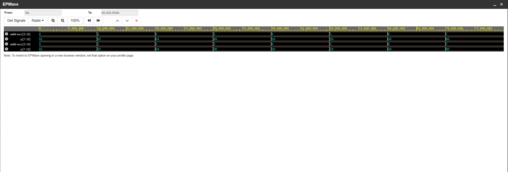

# 3-to-8 Decoder - EDA Playground VHDL and Lab Bench Guide

## Purpose in the Monitoring and Control System

A 3-to-8 decoder converts a three-bit binary command into one active output line. In a monitoring and control system it can select one of eight sensors, actuator channels, display positions, or alarm paths. The one-hot output reduces ambiguity because only the selected channel should be active.

This implementation uses VHDL as required by the assignment brief and is intended for simulation in EDA Playground.

## EDA Playground Deliverables

- Select **VHDL 2008** and a VHDL simulator such as GHDL in EDA Playground.
- Paste `decoder_3_to_8` into the design pane and the code below into the testbench pane.
- Keep the testbench entity name as `testbench`, as used by EDA Playground's VHDL template.
- For GHDL, enter `--vcd=wave.vcd` in **Run options**, tick **Open EPWave after run**, then run the testbench.
- If the simulation does not start, remove the VCD option and run again first. A successful compile confirms the code and top-level setting; then restore `--vcd=wave.vcd` for EPWave.
- Capture a waveform showing all eight input addresses and their one-hot outputs.
- Build and test the equivalent circuit on a laboratory logic trainer.

## Truth Table

`Y` is active-high and one-hot. `Y(0)` is the least significant output.

| A2 | A1 | A0 | Active output |
|----|----|----|---------------|
| 0 | 0 | 0 | Y0 |
| 0 | 0 | 1 | Y1 |
| 0 | 1 | 0 | Y2 |
| 0 | 1 | 1 | Y3 |
| 1 | 0 | 0 | Y4 |
| 1 | 0 | 1 | Y5 |
| 1 | 1 | 0 | Y6 |
| 1 | 1 | 1 | Y7 |

## VHDL Source - `decoder_3_to_8.vhd`

```vhdl
library ieee;
use ieee.std_logic_1164.all;

entity decoder_3_to_8 is
    port (
        address : in  std_logic_vector(2 downto 0);
        Y       : out std_logic_vector(7 downto 0)
    );
end entity decoder_3_to_8;

architecture rtl of decoder_3_to_8 is
begin
    with address select
        Y <= "00000001" when "000",
             "00000010" when "001",
             "00000100" when "010",
             "00001000" when "011",
             "00010000" when "100",
             "00100000" when "101",
             "01000000" when "110",
             "10000000" when "111",
             "00000000" when others;
end architecture rtl;
```

## Design Code Explanation

The `ieee.std_logic_1164` package defines `std_logic` and `std_logic_vector`, which model digital signals and multi-bit buses. The `decoder_3_to_8` entity defines the external interface: `address(2 downto 0)` is the three-bit input address, while `Y(7 downto 0)` is the eight-bit output bus. `downto` means bit 2 is the most significant address bit and bit 0 is the least significant bit.

The `rtl` architecture uses a concurrent selected signal assignment:

```vhdl
with address select
    Y <= "00000001" when "000",
         ...
         "10000000" when "111",
         "00000000" when others;
```

This describes combinational logic. Whenever `address` changes, the matching row is selected without a clock edge or stored state. The output values are one-hot: one bit is `'1'` and the remaining seven bits are `'0'`. For example, input `"101"` selects `"00100000"`, so only `Y(5)` is high. The final `when others` branch gives a defined safe output of all zeros if the simulator sees an invalid `std_logic` value such as `X`, `U`, or `Z` in the address bus.

## Simulation Testbench - `testbench.vhd`

```vhdl
library ieee;
use ieee.std_logic_1164.all;
use ieee.numeric_std.all;

entity testbench is
end entity testbench;

architecture tb of testbench is
    component decoder_3_to_8 is
        port (
            address : in  std_logic_vector(2 downto 0);
            Y       : out std_logic_vector(7 downto 0)
        );
    end component;

    signal address : std_logic_vector(2 downto 0) := "000";
    signal Y       : std_logic_vector(7 downto 0);
begin
    DUT: decoder_3_to_8 port map (address, Y);

    stimulus: process
    begin
        for index in 0 to 7 loop
            case index is
                when 0 => address <= "000";
                when 1 => address <= "001";
                when 2 => address <= "010";
                when 3 => address <= "011";
                when 4 => address <= "100";
                when 5 => address <= "101";
                when 6 => address <= "110";
                when 7 => address <= "111";
            end case;
            wait for 10 ns;
            assert Y = std_logic_vector(to_unsigned(2**index, Y'length))
                report "Decoder output failed" severity error;
        end loop;
        report "3-to-8 decoder test passed" severity note;
        wait;
    end process;
end architecture tb;
```

## Testbench Code Explanation

The testbench has no ports because it is the top-level simulation environment. Its `component decoder_3_to_8` declaration repeats the decoder interface so that `DUT` (device under test) can connect the testbench signals `address` and `Y` to the design.

The `stimulus` process applies all eight valid address values, holding each for 10 ns. The `case` statement changes the address in binary order from `000` to `111`. After each delay, the assertion calculates the expected one-hot pattern using $2^{index}$, converts that number to an eight-bit `std_logic_vector`, and compares it with `Y`. Any mismatch produces `Decoder output failed` with error severity. The final note reports a successful exhaustive test after all eight address values have passed.

## Expected Simulation Evidence

Each 10 ns address step must activate exactly one `Y` bit. For example, `address=101` must produce `Y=00100000`; no other bit may be high. Attach the simulation waveform and compare every row with the truth table.

## Captured Simulation Waveform and Interpretation



The waveform covers 0 ns to 80 ns. The `address[2:0]` signal advances through decimal values 0 to 7, which correspond to binary `000` to `111`. EPWave displays bus values in hexadecimal, so the output sequence shown as `01`, `02`, `04`, `08`, `10`, `20`, `40`, and `80` represents the following binary values:

| Time interval | Address | `Y[7:0]` shown by EPWave | Binary output | Active output | Result |
|---------------|---------|--------------------------|---------------|---------------|--------|
| 0-10 ns | `000` | `01` | `00000001` | Y0 | Pass |
| 10-20 ns | `001` | `02` | `00000010` | Y1 | Pass |
| 20-30 ns | `010` | `04` | `00000100` | Y2 | Pass |
| 30-40 ns | `011` | `08` | `00001000` | Y3 | Pass |
| 40-50 ns | `100` | `10` | `00010000` | Y4 | Pass |
| 50-60 ns | `101` | `20` | `00100000` | Y5 | Pass |
| 60-70 ns | `110` | `40` | `01000000` | Y6 | Pass |
| 70-80 ns | `111` | `80` | `10000000` | Y7 | Pass |

The two identical `address` and `Y` trace pairs are expected. One pair belongs to the testbench and the other belongs to the instantiated DUT. They show the same values because the `port map` connects each testbench signal directly to its corresponding decoder port. The evidence demonstrates that exactly one output changes high for every valid input address, matching the truth table and confirming correct one-hot decoding.

## Lab Bench Implementation and Record

Use a 74HC138/74LS138 decoder where permitted. Note that this device commonly has active-low outputs and enable pins: connect enables according to the data sheet and either invert the outputs or record the active-low convention. Connect three switches to the inputs and use LEDs with current-limiting resistors on the outputs.

| A2 | A1 | A0 | Expected selected output | Observed output/LED | One output only? | Pass/Fail |
|----|----|----|--------------------------|---------------------|------------------|-----------|
| 0 | 0 | 0 | Y0 |  |  |  |
| 0 | 0 | 1 | Y1 |  |  |  |
| 0 | 1 | 0 | Y2 |  |  |  |
| 0 | 1 | 1 | Y3 |  |  |  |
| 1 | 0 | 0 | Y4 |  |  |  |
| 1 | 0 | 1 | Y5 |  |  |  |
| 1 | 1 | 0 | Y6 |  |  |  |
| 1 | 1 | 1 | Y7 |  |  |  |

## Performance and Critical Evaluation

This is combinational logic. Assess propagation delay from address input to output, fan-out, supply-voltage compatibility, power dissipation, and transient glitches when address bits change asynchronously. A decoder should not directly enable hazardous outputs without an interlock, because a changing address can briefly activate an unintended line.

Typical errors include treating a 74HC138's active-low outputs as active-high, omitting its enable wiring, mixing output bit order, or missing a default branch that leads to simulation unknowns. Report the actual error, cause, correction, and repeat test. Use exhaustive simulation for all eight addresses and verify the one-hot property.

## Reliability and Professional Engineering

Digital selection failures can choose the wrong actuator or sensor channel. Use enable interlocks, synchronise control signals where needed, debounce manual switches, and apply boundary and fault-injection tests. Maintain a reviewed truth table, schematic, source revision history, waveform captures, and lab record. Design modules should be reusable and documented with their input/output convention; third-party IP, vendor symbols, and library models must have recorded ownership, licence, version, and suitability for the intended deployment.