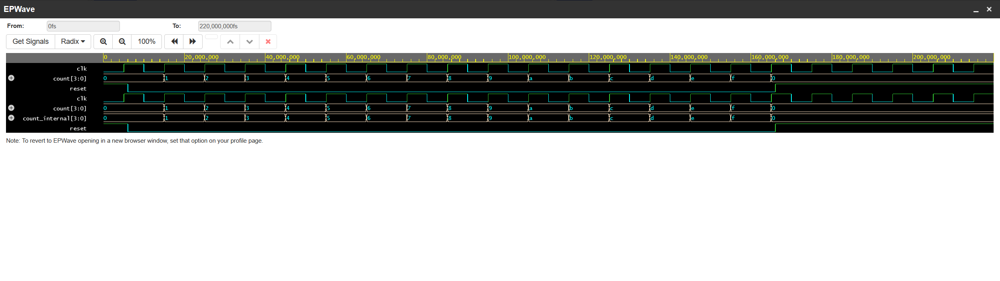

# 4-bit Up Counter - EDA Playground VHDL and Lab Bench Guide

## Purpose in the Monitoring and Control System

A 4-bit up counter counts clock events from `0000` to `1111` and then wraps to `0000`. It can count sampled sensor events, timing pulses, production items, or alarm occurrences in a digital monitoring and control system. The reset input provides a known safe start state.

This implementation uses VHDL as required by the assignment brief and is intended for simulation in EDA Playground.

## EDA Playground Settings

Use **Testbench + Design** with language set to `VHDL`, the top entity set to `testbench`, and simulator set to `GHDL 5.1.1`. Under **Simulator Options**, enable **Open EPWave after run** before starting the simulation. For GHDL waveform output, enter `--vcd=wave.vcd` in **Run Options**.


## EDA Playground Deliverables

- Select **VHDL 2008** and a VHDL simulator such as GHDL in EDA Playground.
- Paste `up_counter_4bit` into the design pane and the code below into the testbench pane.
- Keep the testbench entity name as `testbench`, as used by EDA Playground's VHDL template.
- In **Simulator Options**, tick **Open EPWave after run**. For GHDL, enter `--vcd=wave.vcd` in **Run Options**, then run the testbench.
- If the simulation does not start, remove the VCD option and run again first. A successful compile confirms the code and top-level setting; then restore `--vcd=wave.vcd` for EPWave.
- Simulate reset, at least 16 rising clock edges, and rollover.
- Capture a waveform showing `clk`, `reset`, and `count`.
- Build an equivalent counter on the lab bench and complete the results record.

## State Table

The reset in this design is synchronous and active-high: it is sampled on the rising edge of `clk`.

| Current count | Reset | Next count after rising clock edge |
|---------------|-------|-----------------------------------|
| Any value | 1 | 0000 |
| 0000 | 0 | 0001 |
| 0001 | 0 | 0010 |
| 0010 | 0 | 0011 |
| 0011 | 0 | 0100 |
| 0100 | 0 | 0101 |
| 0101 | 0 | 0110 |
| 0110 | 0 | 0111 |
| 0111 | 0 | 1000 |
| 1000 | 0 | 1001 |
| 1001 | 0 | 1010 |
| 1010 | 0 | 1011 |
| 1011 | 0 | 1100 |
| 1100 | 0 | 1101 |
| 1101 | 0 | 1110 |
| 1110 | 0 | 1111 |
| 1111 | 0 | 0000 |

## VHDL Source - `up_counter_4bit.vhd`

```vhdl
library ieee;
use ieee.std_logic_1164.all;
use ieee.numeric_std.all;

entity up_counter_4bit is
    port (
        clk   : in  std_logic;
        reset : in  std_logic;
        count : out std_logic_vector(3 downto 0)
    );
end entity up_counter_4bit;

architecture rtl of up_counter_4bit is
    signal count_internal : unsigned(3 downto 0) := (others => '0');
begin
    process (clk)
    begin
        if rising_edge(clk) then
            if reset = '1' then
                count_internal <= (others => '0');
            else
                count_internal <= count_internal + 1;
            end if;
        end if;
    end process;

    count <= std_logic_vector(count_internal);
end architecture rtl;
```

## Design Code Explanation

The design imports `ieee.std_logic_1164` for the `std_logic` clock and reset signals, and `ieee.numeric_std` for the `unsigned` numeric type. The entity provides three connections: `clk` is the clock input, `reset` is an active-high reset input, and `count(3 downto 0)` is the four-bit output.

The internal signal `count_internal` is declared as `unsigned(3 downto 0)` so it can be incremented arithmetically. It starts at `0000`, giving the counter a defined simulation state. The counter process is sensitive only to `clk`, and `rising_edge(clk)` ensures that the count changes only at the low-to-high transition of the clock. This makes it a synchronous sequential circuit rather than combinational logic.

When `reset = '1'` at a rising clock edge, the design assigns all four internal bits to zero. Otherwise, `count_internal <= count_internal + 1` increments the binary value by one. Because it is four bits wide, adding one to `1111` overflows naturally to `0000`; this is the required rollover after 15. The non-blocking VHDL signal assignment operator `<=` ensures the new count is applied after the clocked process completes. Finally, `std_logic_vector(count_internal)` converts the internal numeric value to the output signal type.

## Simulation Testbench - `testbench.vhd`

```vhdl
library ieee;
use ieee.std_logic_1164.all;
use ieee.numeric_std.all;

entity testbench is
end entity testbench;

architecture tb of testbench is
    component up_counter_4bit is
        port (
            clk   : in  std_logic;
            reset : in  std_logic;
            count : out std_logic_vector(3 downto 0)
        );
    end component;

    signal clk   : std_logic := '0';
    signal reset : std_logic := '1';
    signal count : std_logic_vector(3 downto 0);
begin
    DUT: up_counter_4bit port map (clk, reset, count);

    clock_generator: process
    begin
        while now < 220 ns loop
            clk <= '0'; wait for 5 ns;
            clk <= '1'; wait for 5 ns;
        end loop;
        wait;
    end process;

    stimulus: process
    begin
        wait until rising_edge(clk);
        wait for 1 ns;
        assert count = "0000" report "Reset failed" severity error;
        reset <= '0';

        for expected_count in 1 to 16 loop
            wait until rising_edge(clk);
            wait for 1 ns;
            assert unsigned(count) = to_unsigned(expected_count mod 16, count'length)
                report "Count or rollover failed" severity error;
        end loop;

        reset <= '1';
        wait until rising_edge(clk);
        wait for 1 ns;
        assert count = "0000" report "Reset recovery failed" severity error;
        report "4-bit counter test passed" severity note;
        wait;
    end process;
end architecture tb;
```

## Testbench Code Explanation

The testbench has no ports because it provides the complete simulation environment. It declares the counter as a component and connects it as the DUT (device under test). The `clk`, `reset`, and `count` signals are visible to EPWave.

The `clock_generator` process produces a clock with a 10 ns period: it drives `clk` low for 5 ns and high for 5 ns. The `stimulus` process first leaves `reset` high and waits for a rising edge. It then checks that the counter is `0000`, proving that the synchronous reset has operated. After reset is released, the loop checks 16 successive rising edges. It expects values 1 through 15 followed by 0, using `expected_count mod 16` to represent the four-bit rollover. The final reset assertion confirms that a later reset pulse returns the counter to zero on its next rising clock edge.

## Expected Simulation Evidence

On the first rising edge while `reset=1`, `count` becomes `0000`. After reset is released, it increments only on rising edges: `0001`, `0010`, through `1111`, then rolls over to `0000` on the sixteenth count. The later reset pulse must return `count` to `0000` at its next rising edge. Include the waveform and annotate the reset and rollover points.

## Captured Simulation Waveform and Interpretation



The EPWave capture shows the clock (`clk`), reset signal (`reset`), public output (`count[3:0]`), and internal counter signal (`count_internal[3:0]`). EPWave is displaying the four-bit buses in hexadecimal, so the visible sequence `0`, `1`, `2`, ..., `9`, `a`, `b`, `c`, `d`, `e`, `f` represents decimal values 0 to 15.

At the start of the waveform, `reset` is high. At the first rising edge of `clk`, the count is held at `0`, verifying the synchronous active-high reset. Reset is then released, and the count increments once per rising edge: `1`, `2`, `3`, through `f`. The next rising edge changes `f` to `0`, demonstrating correct four-bit rollover. Later in the capture, reset is asserted again. The counter returns to `0` on the following rising clock edge, confirming reset recovery.

| Observed waveform feature | Meaning | Verification outcome |
|---------------------------|---------|----------------------|
| Clock period is 10 ns | A rising edge occurs every 10 ns and is the only event that updates the counter. | Correct synchronous operation. |
| Initial `reset = 1` | The output remains at `0` at the first rising edge. | Reset test passes. |
| Count sequence `0` to `f` | Each rising edge increments the four-bit binary value by one. | Counting test passes. |
| `f` changes to `0` | Decimal 15 overflows to decimal 0 in a four-bit register. | Rollover test passes. |
| Later reset pulse | The count returns to `0` at the next rising edge after reset is asserted. | Reset recovery test passes. |

EPWave may show duplicate `clk`, `reset`, and `count` traces. The upper signals belong to the testbench, while the lower signals belong to the DUT. `count_internal` appears only inside the DUT. Their matching transitions confirm that the testbench connections and output conversion are operating correctly.

## Lab Bench Implementation and Record

Use a 74HC161/74LS161 synchronous binary counter, or construct the counter from flip-flops if required. Follow the exact device data sheet for the clock, clear/reset, enable, load, and output polarity. Use a debounced clock source rather than an unconditioned push button. Connect LEDs with current-limiting resistors to `Q0` to `Q3`.

| Test | Procedure | Expected result | Observed result | Pass/Fail |
|------|-----------|-----------------|-----------------|-----------|
| Reset | Assert reset and apply a clock edge | `0000` |  |  |
| Count | Apply 1 to 15 clock edges after reset | Binary count increments once per edge |  |  |
| Rollover | Apply the sixteenth edge | `1111` changes to `0000` |  |  |
| Reset recovery | Reset while counting, then release it | Restarts from `0000` |  |  |

Record the clock source and frequency, IC part number, supply voltage, reset wiring, and whether LEDs represent active-high or active-low outputs.

## Performance and Critical Evaluation

As a sequential circuit, performance depends on clock period, clock-to-Q delay, setup time, hold time, reset timing, fan-out, and power consumption. The minimum clock period must exceed the relevant timing path; otherwise metastability or incorrect counts may occur. A mechanical push button can create multiple edges through bounce, producing skipped counts. For a high-frequency system, use timing analysis and a clean clock distribution network.

Common faults include using a variable or combinational process incorrectly for clocked logic, failing to initialise or reset the counter, applying reset between edges while expecting an immediate change in this synchronous design, and connecting an active-low hardware clear as though it were active-high. Describe only faults actually found, their cause, correction, and rerun evidence.

## Reliability and Professional Engineering

Key risks are missed or extra clock edges, reset failure, metastability from asynchronous signals, timing violations, incomplete rollover tests, and incorrect device polarity. Improve confidence with a documented clock/reset specification, simulation of reset and rollover, assertions or self-checking testbenches where supported, static timing analysis for the target hardware, lab validation using a known-frequency source, and review of the schematic and HDL.

Treat HDL, testbenches, waveforms, schematics, and test records as controlled design documentation. Reusable modules should have explicit interfaces and version history. Verify code before release, avoid unlicensed copying of IP or vendor models, and record IP ownership and licence terms. These practices support traceable maintenance, reliable deployment, and professional accountability.