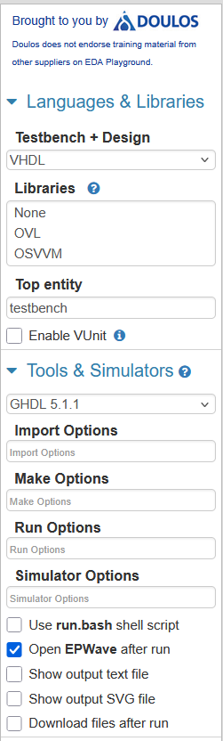
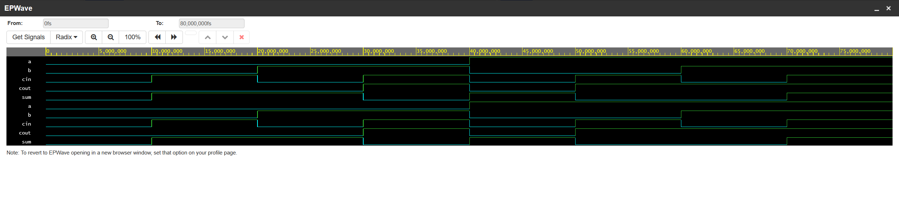

# Full Adder - EDA Playground VHDL and Lab Bench Guide

## Purpose in the Monitoring and Control System

The full adder combines two one-bit digital values and a carry input. In a proposed monitoring and control system it can form part of an arithmetic logic unit used to add sensor values, calculate thresholds, increment stored measurements, or combine alarm counts. Multiple full adders can be cascaded to process multi-bit values after analogue-to-digital conversion.

This implementation uses VHDL as required by the assignment brief and is intended for simulation in EDA Playground.

## EDA Playground Settings

Use **Testbench + Design** with language set to `VHDL`, the top entity set to `testbench`, and simulator set to `GHDL 5.1.1`. Under **Simulator Options**, enable **Open EPWave after run** before starting the simulation. For GHDL waveform output, enter `--vcd=wave.vcd` in **Run Options**.



## EDA Playground Deliverables

- Select **VHDL 2008** and a VHDL simulator such as GHDL in EDA Playground.
- Paste `full_adder` into the design pane and the code below into the testbench pane.
- Keep the testbench entity name as `testbench`, as used by EDA Playground's VHDL template.
- In **Simulator Options**, tick **Open EPWave after run**. For GHDL, enter `--vcd=wave.vcd` in **Run Options**, then run the testbench.
- If the simulation does not start, remove the VCD option and run again first. A successful compile confirms the code and top-level setting; then restore `--vcd=wave.vcd` for EPWave.
- Save a screenshot of the waveform with input and output signal names visible.
- Build the equivalent gate-level circuit on the lab bench and record the results table.

## Truth Table

| A | B | Cin | Sum | Cout |
|---|---|-----|-----|------|
| 0 | 0 | 0 | 0 | 0 |
| 0 | 0 | 1 | 1 | 0 |
| 0 | 1 | 0 | 1 | 0 |
| 0 | 1 | 1 | 0 | 1 |
| 1 | 0 | 0 | 1 | 0 |
| 1 | 0 | 1 | 0 | 1 |
| 1 | 1 | 0 | 0 | 1 |
| 1 | 1 | 1 | 1 | 1 |

The governing equations are $Sum=A\oplus B\oplus Cin$ and $Cout=AB+ACin+BCin$.

## VHDL Source - `full_adder.vhd`

```vhdl
library ieee;
use ieee.std_logic_1164.all;

entity full_adder is
    port (
        A    : in  std_logic;
        B    : in  std_logic;
        Cin  : in  std_logic;
        Sum  : out std_logic;
        Cout : out std_logic
    );
end entity full_adder;

architecture rtl of full_adder is
begin
    Sum  <= A xor B xor Cin;
    Cout <= (A and B) or (A and Cin) or (B and Cin);
end architecture rtl;
```

## Design Code Explanation

The `ieee.std_logic_1164` library supplies the `std_logic` type used for all one-bit signals. The `full_adder` entity defines three inputs and two outputs: `A` and `B` are the bits being added, `Cin` is the carry input from a previous bit position, `Sum` is the result bit, and `Cout` is the carry output for the next bit position.

The architecture is combinational because it uses concurrent signal assignments rather than a clocked process. The first assignment, `Sum <= A xor B xor Cin`, produces a high sum bit only when an odd number of the three inputs are high. The second assignment, `Cout <= (A and B) or (A and Cin) or (B and Cin)`, produces a carry when at least two of the three inputs are high. The parentheses make each AND term explicit before the OR operation combines them. Since there is no stored state or clock, outputs update whenever any input changes, subject to propagation delay in physical hardware.

## Simulation Testbench - `testbench.vhd`

```vhdl
library ieee;
use ieee.std_logic_1164.all;

entity testbench is
end entity testbench;

architecture tb of testbench is
    component full_adder is
        port (
            A    : in  std_logic;
            B    : in  std_logic;
            Cin  : in  std_logic;
            Sum  : out std_logic;
            Cout : out std_logic
        );
    end component;

    signal A, B, Cin : std_logic := '0';
    signal Sum, Cout : std_logic;
begin
    DUT: full_adder port map (A, B, Cin, Sum, Cout);

    stimulus: process
    begin
        A <= '0'; B <= '0'; Cin <= '0'; wait for 10 ns;
        assert Sum = '0' and Cout = '0' report "000 failed" severity error;
        Cin <= '1'; wait for 10 ns;
        assert Sum = '1' and Cout = '0' report "001 failed" severity error;
        B <= '1'; Cin <= '0'; wait for 10 ns;
        assert Sum = '1' and Cout = '0' report "010 failed" severity error;
        Cin <= '1'; wait for 10 ns;
        assert Sum = '0' and Cout = '1' report "011 failed" severity error;
        A <= '1'; B <= '0'; Cin <= '0'; wait for 10 ns;
        assert Sum = '1' and Cout = '0' report "100 failed" severity error;
        Cin <= '1'; wait for 10 ns;
        assert Sum = '0' and Cout = '1' report "101 failed" severity error;
        B <= '1'; Cin <= '0'; wait for 10 ns;
        assert Sum = '0' and Cout = '1' report "110 failed" severity error;
        Cin <= '1'; wait for 10 ns;
        assert Sum = '1' and Cout = '1' report "111 failed" severity error;
        report "Full adder test passed" severity note;
        wait;
    end process;
end architecture tb;
```

## Testbench Code Explanation

The testbench has no external ports because it creates its own input signals and observes the outputs. The `component full_adder` declaration matches the design interface, and `DUT: full_adder port map (A, B, Cin, Sum, Cout)` connects the testbench signals to the device under test.

The `stimulus` process applies all eight possible three-input combinations. Each vector is held for 10 ns, allowing the combinational outputs to settle before an `assert` statement checks the expected `Sum` and `Cout` values. The assertions make the test self-checking: an incorrect output produces an error identifying the failing binary input vector. The final report, `Full adder test passed`, occurs only after all eight vectors have been evaluated.

## Expected Simulation Evidence

At each 10 ns interval, compare `Sum` and `Cout` against the truth table. The waveform should show `Cout=1` for inputs `011`, `101`, `110`, and `111`; `Sum=1` when an odd number of inputs are high. Include the waveform screenshot and a table stating whether every vector passed.

## Captured Simulation Waveform and Interpretation



The waveform runs from 0 ns to 80 ns and applies one input combination per 10 ns interval. The first five traces are the signals at the testbench level; the lower five traces are the same signals inside the DUT. They match because the `port map` connects the testbench directly to the full adder. The duplicate traces are therefore expected and provide confirmation that the DUT receives the intended inputs.

| Time interval | A | B | Cin | Sum | Cout | Explanation | Result |
|---------------|---|---|-----|-----|------|-------------|--------|
| 0-10 ns | 0 | 0 | 0 | 0 | 0 | No input bits are high, so there is neither a sum bit nor a carry. | Pass |
| 10-20 ns | 0 | 0 | 1 | 1 | 0 | One high input gives an odd parity sum and no carry. | Pass |
| 20-30 ns | 0 | 1 | 0 | 1 | 0 | One high input gives an odd parity sum and no carry. | Pass |
| 30-40 ns | 0 | 1 | 1 | 0 | 1 | Two high inputs add to binary `10`: sum zero with carry one. | Pass |
| 40-50 ns | 1 | 0 | 0 | 1 | 0 | One high input gives an odd parity sum and no carry. | Pass |
| 50-60 ns | 1 | 0 | 1 | 0 | 1 | Two high inputs add to binary `10`: sum zero with carry one. | Pass |
| 60-70 ns | 1 | 1 | 0 | 0 | 1 | `A` and `B` produce binary `10`: sum zero with carry one. | Pass |
| 70-80 ns | 1 | 1 | 1 | 1 | 1 | Three high inputs equal binary `11`: sum one with carry one. | Pass |

The captured results match every row of the truth table. In particular, `Cout` is high for `011`, `101`, `110`, and `111`, which are exactly the four cases containing at least two high inputs. `Sum` is high for `001`, `010`, `100`, and `111`, which are the cases with an odd number of high inputs. This confirms the expected arithmetic operation of the full adder.

## Lab Bench Implementation and Record

Build the circuit with two XOR gates, two AND gates and one OR gate, or use a 74HC283/74LS83 adder IC if the laboratory specification permits it. Use switches or a logic trainer for `A`, `B`, and `Cin`; connect LEDs with suitable current-limiting resistors to `Sum` and `Cout`.

| A | B | Cin | Expected Sum | Expected Cout | Observed Sum | Observed Cout | Pass/Fail |
|---|---|-----|--------------|---------------|--------------|---------------|-----------|
| 0 | 0 | 0 | 0 | 0 |  |  |  |
| 0 | 0 | 1 | 1 | 0 |  |  |  |
| 0 | 1 | 0 | 1 | 0 |  |  |  |
| 0 | 1 | 1 | 0 | 1 |  |  |  |
| 1 | 0 | 0 | 1 | 0 |  |  |  |
| 1 | 0 | 1 | 0 | 1 |  |  |  |
| 1 | 1 | 0 | 0 | 1 |  |  |  |
| 1 | 1 | 1 | 1 | 1 |  |  |  |

Record the supply voltage, IC part numbers, date, equipment used, and any differences between observed LED states and the predicted outputs. Do not leave CMOS inputs floating.

## Performance and Critical Evaluation

The full adder is combinational: outputs change after propagation delay and do not require a clock. Its key constraints are logic propagation delay, fan-out, power consumption, noise margin, and glitch risk when several inputs change at slightly different times. A ripple-carry multi-bit adder accumulates carry delay, so a faster architecture may be required for high-speed processing.

Document any issues actually encountered. Common examples are a missing parenthesis in the carry expression, incorrect XOR/OR substitution, reversed LED polarity, unconnected power pins, or changing inputs too quickly to observe. State the symptom, root cause, corrective action, and the post-fix test that proves resolution.

## Reliability and Professional Engineering

Risks include an incorrect Boolean expression, wiring faults, floating inputs, inadequate test vectors, and unverified timing. Mitigate them through truth-table review, exhaustive simulation of all eight input combinations, peer code review, a documented lab test record, and independent verification against the Boolean equations. Retain version-controlled source files, waveform evidence, and circuit diagrams. Reusable, clearly named modules reduce duplicated design effort; record the ownership and licence of any third-party IP or vendor library used.